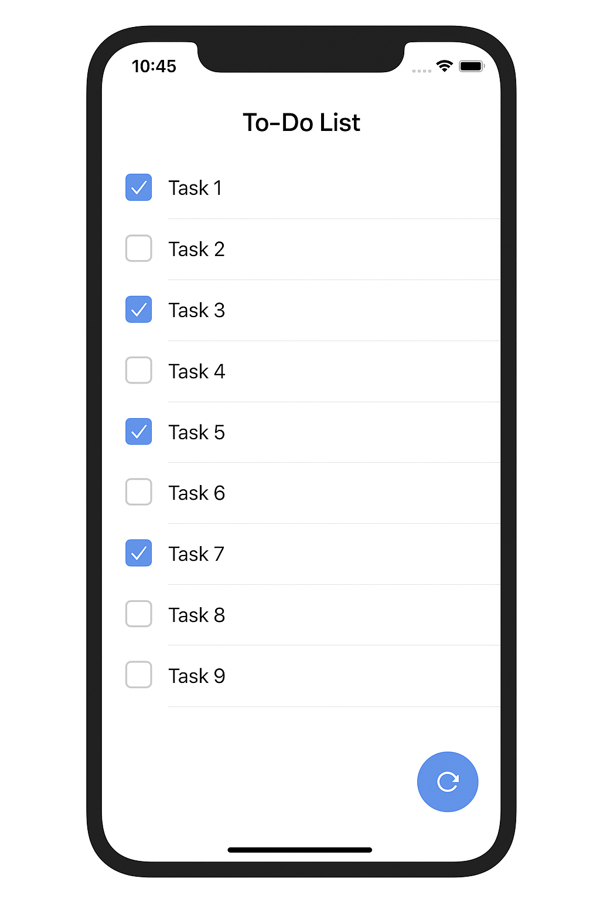

# Todo Test Task

A Flutter test task for candidates to demonstrate their skills in API integration, state management, and UI implementation.

## Task Description

This Flutter project is designed to fetch and display a list of todos from the [JSONPlaceholder API](https://jsonplaceholder.typicode.com/todos). The project compiles and runs but has several incomplete parts that need to be implemented.

## Sample UI



**Expected UI Layout:**

- App bar with title "Todo Test Task"
- List of todo items with:
  - Todo title (with strikethrough if completed)
  - Checkbox on the right side to toggle completion
- Floating action button (refresh icon) in bottom right
- Loading indicator when fetching data
- Error message with retry button if API fails

## Features to Implement

- **API Integration**: Fetch todos from the JSONPlaceholder API
- **State Management**: Use GetX for controller and state management
- **UI Logic**: Connect the existing UI components to real data and functionality
- **Refresh Functionality**: Reload data using the floating action button
- **Error Handling**: Show appropriate error messages and loading states

**Note**: The UI design and layout are already implemented. Focus your efforts on implementing the business logic and data flow.

## Project Structure

```
lib/
 ├─ main.dart                 # App entry point
 ├─ models/
 │   └─ todo.dart            # Todo data model
 ├─ services/
 │   └─ api_service.dart     # API service (incomplete)
 ├─ controllers/
 │   └─ todo_controller.dart # GetX controller (incomplete)
 └─ views/
     └─ home_page.dart       # Main UI (incomplete)
```

## Dependencies

- `get: ^4.6.5` - State management
- `http: ^1.1.0` - HTTP requests

## Setup Instructions

1. **Clone or download the project**
2. **Install dependencies:**
   ```bash
   flutter pub get
   ```
3. **Run the project:**
   ```bash
   flutter run
   ```

## TODO Items to Complete

### 1. API Service (`lib/services/api_service.dart`)

- **Implement `fetchTodos()` method**
  - Make HTTP GET request to `https://jsonplaceholder.typicode.com/todos`
  - Parse JSON response and convert to `List<Todo>`
  - Handle errors appropriately

### 2. Todo Controller (`lib/controllers/todo_controller.dart`)

- **Complete `loadTodos()` method**
  - Set loading state
  - Call API service
  - Update todos list
  - Handle errors
  - Clear loading state
- **Implement `toggleTodoCompletion(int id)` method**
  - Find todo by ID
  - Toggle completion status
  - Update the todo in the list
- **Initialize data loading** in `onInit()`

### 3. UI (`lib/views/home_page.dart`)

- **Replace static placeholder data** with real data from controller
- **Implement refresh button** functionality
- **Connect checkbox onChanged** to toggle completion
- **Implement retry button** in error state
- **Note**: The UI structure is already provided - focus on connecting the logic, not redesigning the interface

## API Endpoint

- **URL**: `https://jsonplaceholder.typicode.com/todos`
- **Method**: GET
- **Response**: Array of todo objects with `id`, `title`, and `completed` fields

## Expected Behavior

1. App should load and display a list of todos from the API
2. Each todo should show its title and completion status
3. Checkboxes should toggle the completion status
4. Refresh button should reload data from the API
5. Loading indicator should show during API calls
6. Error messages should display if API calls fail
7. Retry functionality should work in error states

## Evaluation Criteria

- **Code Quality**: Clean, readable, and well-structured code
- **Error Handling**: Proper error handling and user feedback
- **State Management**: Correct use of GetX patterns
- **UI/UX**: Responsive and user-friendly interface
- **API Integration**: Proper HTTP requests and data parsing

## Tips

- Use the `Todo.fromJson()` factory method to parse API responses
- Leverage GetX reactive variables (`RxList`, `RxBool`, `RxString`)
- Handle both success and error cases in API calls
- Test the app with different network conditions

Good luck! 🚀
# flutter-test-task
